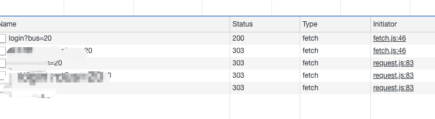
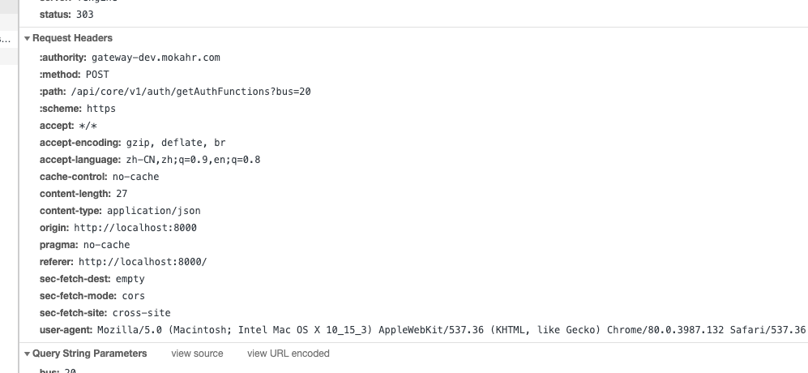

# 解决 本地调试代码不发送 cookie的问题【重复登录失效】
问题描述：昨天升级系统后，打开谷歌，登录本地项目调试(采用代理的方式访问后端测试接口)，发现一直登录不上去，报登录失效没有权限，记录了一下问题的查找和解决思路。
#### 1. 登录立即返回无权限，我第一猜测，应该是登录接口有问题，于是我打开 network

#### 2. 我发现登录接口报200，其余接口报303[不要纠结无权限为什么是 303 而不是 401，QAQ~]，于是点击查看详细

#### 3. 我发现登录时 OK 的呢，那问题出在哪里，我查看无权限的请求，发现请求并未携带 cookie 或 token

#### 4. 查看 application，cookie 为空

#### 5. 倒回去查看登录接口的响应头，验证是否返回了 cookie

#### 6. 明明返回了 cookie却不发送，那怎么回事呢，找了好久，突然发现旁边一个警告⚠️，浮动提示截不了图，原文如下：
this set-cookie didn`t specify a "SameSite" attribute and was default to "SameSite=Lax" and broke the same rules specified in the SameSiteLax value。
大致意思就是：set-cookie 没有 SameSite 属性， 因而设置为默认值 “Lax”，并且违反了值为 SameSiteLax 的规则。
#### 7. 我把这句话放在 Google 和 Stack Overflow 上，没有搜索到任何结果，于是我查找其中的关键词，SameSite，得到如下两篇文章提示
[https://blog.heroku.com/chrome-changes-samesite-cookie](https://blog.heroku.com/chrome-changes-samesite-cookie)
[https://www.chromestatus.com/feature/5088147346030592](https://www.chromestatus.com/feature/5088147346030592)
#### 8. 上面两篇文章中提到，SameSite 是谷歌(也包括 使用 webkit 的 Safari)推出的一个 CSRF 安全策略， 在后端没有返回 SameSite 的情况下，默认设置为 Lax，而 Lax 的等级为中，意味着跨站访问是不能设置和携带 cookie 的，至此，问题的核心找到了
#### 9. 那问题怎么解决呢？目前肯定不能因为开发环境而让后端改接口，但我还是一想就想到了，既然是安全策略，浏览器行为，那一定是可配置的吧，于是我在谷歌设置中搜索

#### 10. 设置为 disabled，然后重启就好了哈哈哈
至此，完美解决~ ✌️