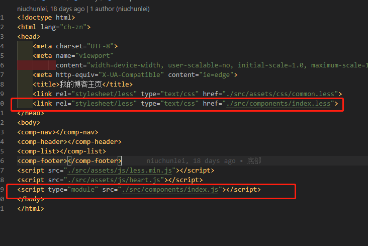

# 从零手写一个简易 GitHub 博客网站的心得与收获
最近看到同事朋友们有漂漂亮亮的博客网站，十分羡慕😍。自己也想使用 GitHub 做一个简简单单的博客，但是又不想与 hexo 等主题模板“撞衫”👚👕，于是手写了一个。同时，为了了解一下 web Components，我选择没有使用 react vue 等这些沉重的框架(因为 GitHub 实在太慢了，用不起框架😃)，而是抛弃框架原生开发。期间也碰到了许许多多有趣的问题，也有了一些有趣的收获，因此记录下来。
## 目标
- 实现一个自己的 github 博客，可以写 markdown 就可以自动生成文章和列表，使用简单，美观简约
## 摘要
- 功能：分【列表页、详情页、自我介绍页】三部分；后续会加入【在线 ppt(markdown版)、在线 markdown、随笔、贴图】等有趣的小功能，敬请期待~
- 自我设计的交互：多变的皮肤；简约设计风格；头部的阅读进度条；加载动画；换肤小风筝；标题 hover 交互；标题切换；抄袭的小心心🧡💛💚💙💜🖤🤍🤎💕~
- markdown 书写博客，使用 node 将博客自动转换成 html，自动生成文章列表(标题、时间、摘要等)
- 组件化开发

具体完成了哪些功能，可查看 commit 记录📝：
[https://github.com/natureStory/naturestory.github.io/commits/master](https://github.com/natureStory/naturestory.github.io/commits/master)
## 主要功能点
### 一、技术
##### web Components
1. 简单介绍下 web Components
    - [点击查看官方文档 (不建议，虽然是中文的)](https://developers.google.com/web/fundamentals/web-components)
    - [点击查看我完整的 web Components 的使用 case (建议，瞟一眼就好)](https://github.com/natureStory/naturestory.github.io/blob/master/src/components/comp-progress/index.js)
    - 是不是特别简单😝
    - 看完来个总结，通过上个例子，发现 web Components 的 template 方式的写法，与 Vue 有些像，而且可以加 scope。但是会把样式也屏蔽了，所以我基本没使用这个功能，写法如下：

    ```js
        constructor() {
            super();
            // 封闭式写法，屏蔽外界
            const shadowRoot = this.attachShadow({mode: 'open'});   // 不要问我，我也不知道为啥叫 open
            shadowRoot.innerHTML = template;
            // 开放式写法
            this.innerHTML = CompProgress.template;
            this.timer = null;
        }
    ```

    然后组件也有装载、移除、监听变化、计算属性、渲染等逻辑，类似于 react。组件使用上是用中划线命名区别自有标签名，使用如下方式注册全局组件名

    ```js
        window.customElements.define('comp-markdown-article', CompMarkdownArticle);
    ```

1. 我对 web Components 的使用与处理
    - 博客使用 web Components 组织构建，实现了如下的几个组件
    
    - 使用组件，在 html 中当标签引入即可

    ```html
        <!doctype html>
        <html lang="ch-zn">
        <head>
            ……
        </head>
        <body>
        <comp-nav></comp-nav>
        <comp-header></comp-header>
        <comp-list></comp-list>
        <comp-footer></comp-footer>
        ……
        </body>
        </html>
    ```

    - 组件的组织方式(不同于使用，需要在 html 文件引入所有的组件注册文件)
        1. js

        ```js
        import './comp-aboutme/index.js';
        import './comp-footer/index.js';
        import './comp-header/index.js';
        import './comp-list/index.js';
        import './comp-list-article/index.js';
        import './comp-markdown-article/index.js';
        import './comp-nav/index.js';
        import './comp-progress/index.js';
        ```

        1. css
        
        ```less
        @import "./comp-aboutme/index.less";
        @import "./comp-footer/index.less";
        @import "./comp-header/index.less";
        @import "./comp-list/index.less";
        @import "./comp-list-article/index.less";
        @import "./comp-markdown-article/index.less";
        @import "./comp-nav/index.less";
        @import "./comp-progress/index.less";
        ```
    - 组件的挂载
    
1. 存留的问题
    - 没有实现组件的自动加入索引文件，需要手动添加 (可以通过 node 遍历components 文件夹并自动生成 index.js index.less 索引文件的方式解决)
    - 没有按需加载 (好在我的功能很少，其实比如在“关于我”的页面，也引入了首页的列表组件并注册；可以通过使用 node 解析 html 中使用的组件，生成不同的 index.js index.less 索引文件)
##### markdown
1. 使用 showdown.min.js 解析 markdown
1. markdown 并没有使用 node 提前编译成 html 文章，而是采用了同一个 html 文章模板，根据传入的文件名参数，fetch 请求到相应的 markdown 文件，然后解析为 html 文章
    - 问：此处为什么没有使用 import 方式引入 markdown 文件，而是采用 fetch 呢？因为从 js 文件 import 的文件必须仍然是 js，如果不是，需要在后台配置一下，但是 github 没有后台的，所以……🥺
    - 问：为什么不先把 markdown 编译成 html，还要在客户端多请求一次呢？原因有仨：
        1. 将来不想要这么多 html，只需要一个文章详情页就好了
        1. 将来打算做在线 markdown，终究还是要到前端的
        1. 不编译 markdown，是为了修改文章的时候，不必再运行 node，并且照顾无法运行 node 的情况(比如在 github 上直接编辑文章，不编译如何发布？？？那就不编译呗)
1. 存留的问题：
    - github 访问的压力增加了(需要多请求一个 markdown.min.js)
##### less 
1. 使用 less.min.js 前端解析 less
##### node
1. 使用 node 读取 markdown 的日期、标题、摘要，自动生成文章列表
1. 使用 node 自动生成 html模板 (一个 markdown 文件对应一个 html页，暂时没有通过参数来区分)
##### 防缓存
1. 文章列表、文章等，通过 fetch 请求的地址加入随机数防缓存
    - 问题：请求负荷上来了，速度变慢，体验变差，但是总比不更新文章要好
### 二、设计风格
1. 简约设计风格
    - 因为 github 访问速度的限制，所以除了减少文件体积，还要尽量减少图片的使用，以免影响体验
    - 设计上采用温和的纯色来搭配，看着十分简约清爽
    - 省去了所有碍眼的功能，打造纯阅读体验
1. 扁平化色块
    - 使用温和的扁平化色块，尽量配色不辣眼睛，不刺眼，且右上角提供了有趣的“换肤小风筝”，在任何色调影响阅读体验的时候都可以随时切换皮肤
1. 色块选择
    - 其实除了主色和配色，其余的色值，都是使用滤镜实现的(色值的明暗、透明度、旋转色域等)
### 三、交互
1. 换肤
    - 进入或刷新，都会自动选取一套色彩皮肤
    - 阅读中，如果配色影响阅读体验，可通过右上角有趣的“小风筝”换肤
1. 加载
    - 列表中的加载，通过加载动画缓冲
    - 文章的加载，使用“加载中……”字样，尽量保证简约，不夺取眼球，影响阅读体验
1. 标题 hover
    - 动画：使用 css 旋转填充(没有回来是因为有 bug 没解决掉~)
    - 色彩：使用色彩旋转滤镜，根据主色值自动变化
1. 编辑
    - 标题旁边有“coding on github”按钮，可快速进入 github 编辑(比如发现错别字、记录临时的想法、不想打开编辑器、正在蹲坑等)
## 收获
1. 首先肯定是————收获了一个自己的博客😊
1. 了解了 web Components，其实与 react、vue 的设计模式思路都很像，也表明前端朝着一个组件化工程化的方向不断发展
1. 了解了主题模板做的事情是什么：也就是给个主题 css，然后用 node 生成博客
1. webpack的用途。我们自己不想干啥，webpack 就干了啥(牛皮，鼓掌👏)
1. 自己第一次的去设计交互，设计动画和配色等，蛮有意思的