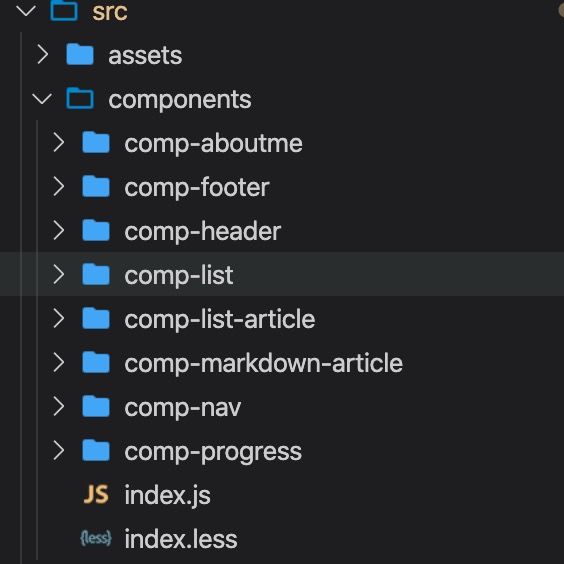
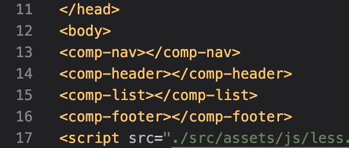

# 从零手写一个简易 GitHub 博客网站的心得与收获
最近看到同事朋友们有漂漂亮亮的博客网站，十分羡慕。自己也想使用 GitHub 做一个简简单单的博客，但是又不想“撞衫”于 hexo 等模板，于是手写了一个。同时为了了解一下 web Components，并且放弃 react vue 等这些沉重的框架(因为 GitHub 实在太慢了😃)。期间也碰到了许许多多有趣的问题，也有了一些有趣的收获，因此记录下来。
## 目标与摘要
1. 功能：分【列表页、详情页、自我介绍页】三部分
1. 自我设计的交互：多变的皮肤；扁平化设计风格；头部的阅读进度条；加载动画；
1. markdown 书写博客，使用 node 将博客自动转换成 html，自动生成文章列表(标题、时间、摘要等)；
1. 组件化；

具体完成的详细功能，可查看 commit 记录：
[https://github.com/natureStory/naturestory.github.io/commits/master](https://github.com/natureStory/naturestory.github.io/commits/master)
## 主要功能点
### 组件化
#### 技术方案
1.  web Components
    1. 简单介绍下 web Components
        - [点击查看官方文档 (不建议)]()
        - [点击查看我的完整 web Components 使用 case (建议，但掠一下就好)](https://github.com/natureStory/naturestory.github.io/blob/master/src/components/comp-progress/index.js)
        - 是不是特别简单😝
        - 看完来个总结，通过上个例子，发现 web Components 的 template 方式的写法，与 Vue 有些像，而且可以加 scope ()。但是会把样式也屏蔽了，所以我基本没使用到。
        ```js
            constructor() {
                super();

                // 封闭式写法，屏蔽外界
                // const shadowRoot = this.attachShadow({mode: 'open'});
                // shadowRoot.innerHTML = template;

                this.innerHTML = CompProgress.template;
                this.timer = null;
            }
        ```
        然后组件也有装载、移除、监听变化、计算属性、渲染等逻辑，类似于 react。组件使用上是用中划线命名区别自有标签名，使用如下方式注册全局组件名
        ```js
            window.customElements.define('comp-markdown-article', CompMarkdownArticle);
        ```
    1. 我对 web Components 的使用与处理
        1. 博客使用 web Components 组织构建，实现了如下的几个组件
        
        2. 使用，在 html 中当标签引入即可
        
####