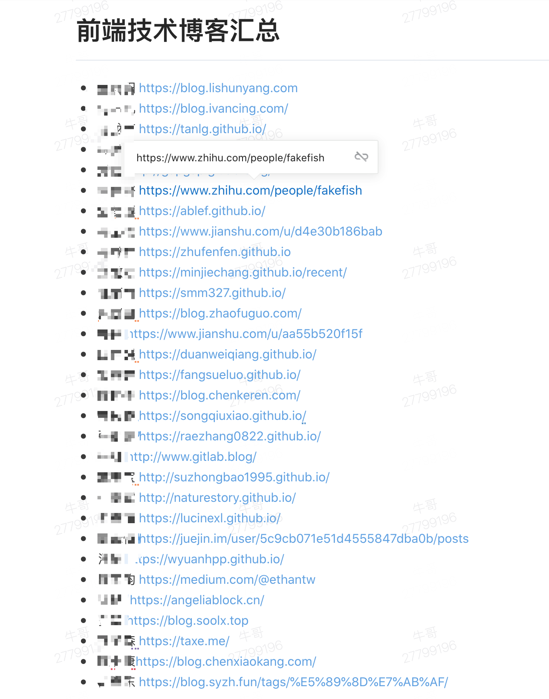
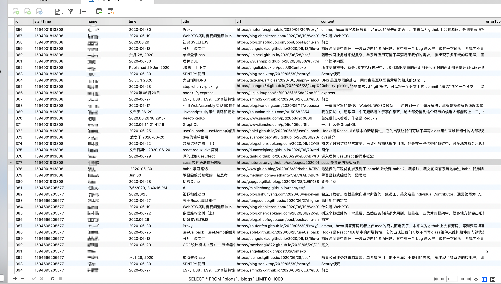

# 使用 node 爬取并检查同事们最新的博客

我们公司制定了一个成长目标，其中有一条，每月必须产出至少一条博客，否则需要请公司所有的前端同事喝奶茶。我觉得前端人太多了，如果逐个检查太累了，于是我做了一个自动爬取并检查博客的工具。

## 目标
自动爬取同事们的博客，找到最新的博客内容，并记录下最新博客的标题、发布时间、人名、内容等信息。

## 使用到的技术
eggjs、node、mysql、puppeteer……

### 自动登录石墨文档，爬取博客列表
博客列表如下：


```
// 打开一个页签
const page = await browser.newPage();

// 打开石墨登录页
await page.goto('https://shimo.im/login?from=home');

// 键入用户名密码
await page.type('input[name="mobileOrEmail"]', 'xxx@xxx.com');
await page.type('input[name="password"]', 'xxx');

// 回车
await page.keyboard.press('Enter');

// 等候 2s
await page.waitFor(2000);

// 跳转到博客列表页
await page.goto('https://shimo.im/docs/xxx');

// 等待 2.5s
await page.waitFor(2500);

// 读取博客列表内容
blogs = await page.$eval('.ql-bullet-container', el => el.innerText);
```

### 博客列表数据处理

```
// 按照换行分隔
const blogsArr = blogs.trim().split('\n');

// 存储本次解析的数量，执行的时间到 mysql
await app.mysql.update('executeStatus', {
    id: 100001,
    totalBlogs: blogsArr.length,
    parsedBlogs: 0,
    startTime: new Date().valueOf(),
});

// 博客解析为名字和地址
const handleBlogs = blogsArr.map(item => {
    return {
        name: new RegExp(/.*(?=http)/).exec(item)[0].trim(),
        url: new RegExp(/(?=http).*/).exec(item)[0].trim(),
    };
});
// 对每一篇博客调用 handleBlog 解析处理
handleBlogs.forEach(async item => {
    handleBlog(await browser.newPage(), app, item);
});
```

### 博客解析

以下的解析 dom 规则应该存入数据库，在前端做可视化配置，限于时间还没做
```
const handleBlog = async (page, app, { name, url = '' }) => {
    // 博客的基本信息，需要 名字、创建时间、标题、最新博客地址、内容、错误类型（解析失败、网络错误等）
    const blogInfo = { name, time: '', title: '', url: '', content: '', errorType: '' };
    // 不同人的博客，匹配不同的规则
    if (new RegExp(/lishunyang/).test(url)) {
        // 调用统一的处理
        commonHandle(page, 1, app, {
            blogInfo,
            url,
            // 首篇博客的地址解析 dom 以及取值方式
            firstBlogSelector: [ '.container .list .item a', el => el.href ],
            // 标题解析 dom 以及取值方式
            titleSelector: [ '.container .header .title', el => el.innerText ],
            // 时间解析 dom 以及取值方式
            timeSelector: [ '.container .header .date', el => el.innerText ],
            // 内容解析 dom 以及取值方式
            contentSelector: [ '.container .content .content__default', el => el.innerText ],
        });
    } else if (……) {
        ……
    }
}
```
commonHandle 的处理
```
const commonHandle = async (page, timeoutNumber, app, params) => {
  const { blogInfo, url, firstBlogSelector, timeSelector, titleSelector, contentSelector } = params;
  try {
    await page.goto(url); // 访问博客主页地址
  } catch (error) {
      // 十次的重试
    if (timeoutNumber < 10) {
      const tempTimeoutNumber = timeoutNumber + 1;
      commonHandle(page, tempTimeoutNumber, app, params);
    } else {
        // 存储错误信息，并入库
      blogInfo.errorType = errorType.BlogUrlParseError;
      const executeStatus = await app.mysql.get('executeStatus');
      await app.mysql.update('executeStatus', {
        id: 100001,
        parsedBlogs: executeStatus.parsedBlogs + 1,
        lastModifiedTime: new Date().valueOf(),
      });
      // 调用文章插入
      insertOrUpdateBlogs(app, blogInfo, executeStatus);
    }
    return;
  }

  if (new RegExp(/naturestory/).test(url)) { // 适配我的博客，特殊处理（因为只有我的博客主页是非静态的，需要请求博客列表接口）
    await page.waitFor(5000);
  }

  try {
    blogInfo.url = await page.$eval(...firstBlogSelector); // 解析最新博客地址
  } catch (error) {
    blogInfo.errorType = errorType.BlogDomParseError;
    const executeStatus = await app.mysql.get('executeStatus');
    await app.mysql.update('executeStatus', {
      id: 100001,
      parsedBlogs: executeStatus.parsedBlogs + 1,
      lastModifiedTime: new Date().valueOf(),
    });
    insertOrUpdateBlogs(app, blogInfo, executeStatus);
    return;
  }

  try {
    await page.goto(blogInfo.url); // 访问博客最新一篇博客
  } catch (error) {
    if (timeoutNumber < 10) {
      const tempTimeoutNumber = timeoutNumber + 1;
      commonHandle(page, tempTimeoutNumber, app, params);
    } else {
      blogInfo.errorType = errorType.BlogUrlParseError;
      const executeStatus = await app.mysql.get('executeStatus');
      await app.mysql.update('executeStatus', {
        id: 100001,
        parsedBlogs: executeStatus.parsedBlogs + 1,
        lastModifiedTime: new Date().valueOf(),
      });
      insertOrUpdateBlogs(app, blogInfo, executeStatus);
    }
    return;
  }

  if (new RegExp(/naturestory/).test(url)) { // 适配我的博客，原因同上
    await page.waitFor(5000);
  }

  try {
    blogInfo.time = await page.$eval(...timeSelector); // 解析博客时间
    blogInfo.title = await page.$eval(...titleSelector); // 解析博客标题
    blogInfo.content = await page.$eval(...contentSelector); // 解析博客内容
  } catch (error) {
    blogInfo.errorType = errorType.BlogDomParseError;
    const executeStatus = await app.mysql.get('executeStatus');
    await app.mysql.update('executeStatus', {
      id: 100001,
      parsedBlogs: executeStatus.parsedBlogs + 1,
      lastModifiedTime: new Date().valueOf(),
    });
    insertOrUpdateBlogs(app, blogInfo, executeStatus);
    return;
  }
  console.log('parse success!');
  const executeStatus = await app.mysql.get('executeStatus');
  await app.mysql.update('executeStatus', {
    id: 100001,
    parsedBlogs: executeStatus.parsedBlogs + 1,
    lastModifiedTime: new Date().valueOf(),
  });
  insertOrUpdateBlogs(app, blogInfo, executeStatus);
};
```

再调用统一的入库函数，insertOrUpdateBlogs
```
const insertOrUpdateBlogs = async (app, blogInfo, executeStatus) => {
  const targetBlog = await app.mysql.get('blogs', {
    name: blogInfo.name,
    startTime: executeStatus.startTime,
  });
  // 更新还是插入
  if (targetBlog) {
    await app.mysql.update('blogs', {
      ...blogInfo,
      // 内容仅保存 一万五千字
      content: (blogInfo.content || '').slice(0, 15000),
    }, {
      startTime: executeStatus.startTime,
      name: blogInfo.name,
    });
  } else {
    await app.mysql.insert('blogs', {
      ...blogInfo,
      content: (blogInfo.content || '').slice(0, 15000),
      startTime: executeStatus.startTime,
    });
  }
};
```

### 效果


### 剩余待完成内容
1. 前端可视化，计算当月谁没写博客，谁需要请奶茶
2. 爬虫解析规则应该可视化配置并且入库，而不是在代码里写死
3. 错误重试、增量爬取
4. 查重（保存博客内容就是为了查重，可以把博客内容均分为十份，使用 google 强匹配搜索(不能模糊搜索)，然后对搜索结果的条数简单相加，作为重复指数(不过，热点高的内容，搜索结果势必也多，因此必须强匹配搜索，不能算作重复，仅仅叫重复指数，且仅供参考 QAQ~)）