# 表达式的语法解析与前端可视化

对于 Boolean 表达式，怎么进行语法解析，并用于前端可视化渲染呢？今天我来给大家分享一下

## ppt地址
[分享.pptx](http://view.officeapps.live.com/op/view.aspx?src=https://naturestory.github.io/src/data/articles/2020.08.23page/分享.pptx)

## 相关的 git 地址
[expression-parser：jison 语法解析、可视化渲染](https://github.com/natureStory/expression-parser)

[simplescssbabel：简单的字符方法处理 less 语法嵌套](https://github.com/natureStory/simplescssbabel)

## 目标
1. 将 Boolean 表达式进行语法解析；
2. 将抽象语法树进行可视化渲染；

## 使用到的技术
jison

## 抽象后的 Boolean 表达式
A && B && ( C || D ) && ( E || F )

## 可视化后的结果
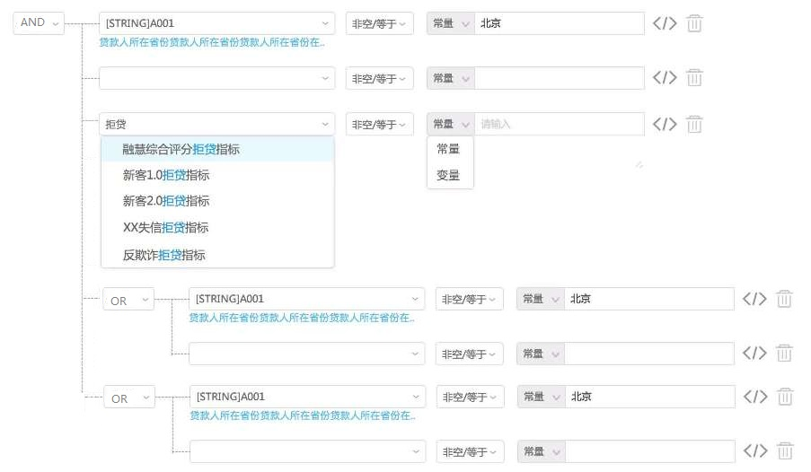

## 语法解析的流程
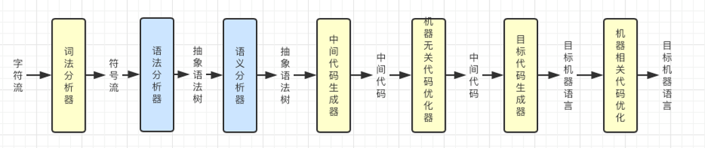
简化后：**词法分析 -> 语法分析 -> 预编译 -> 解释执行**

### 1. 词法分析
词法分析是将字符流转换为记号流。把输入的字符串分解为一些对编程语言有意义的词法单元。

从左往右读取字符流，识别有意义的标识符(常量，变量，边界符，操作符，函数，参数)，忽略无用空格，换行等。
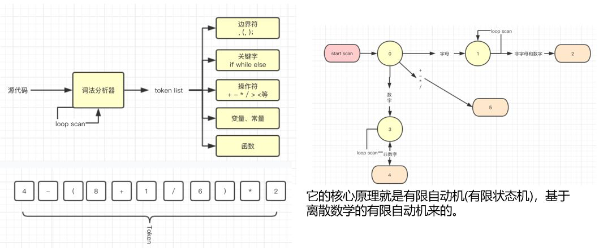
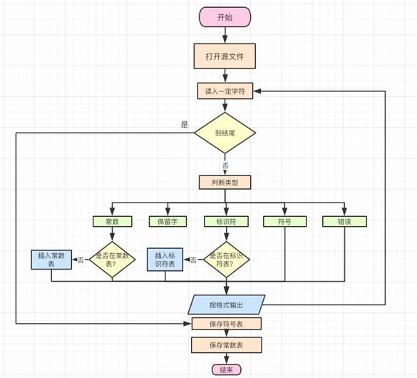

### 2. 语法分析
会将上一步的词法单元集合分析并最终转换为一个由元素逐级嵌套所组成的代表了程序语法结构的树，即抽象语法树（AST）
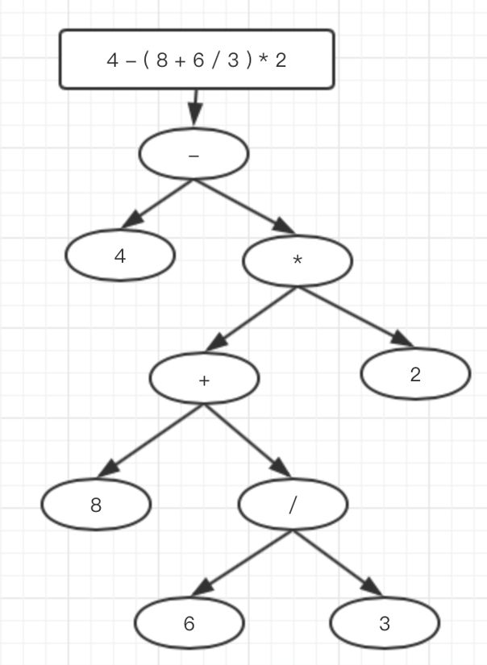


### 3. 预编译
将上一步的抽象语法树AST转换为可执行代码

### 4. 解释执行
执行
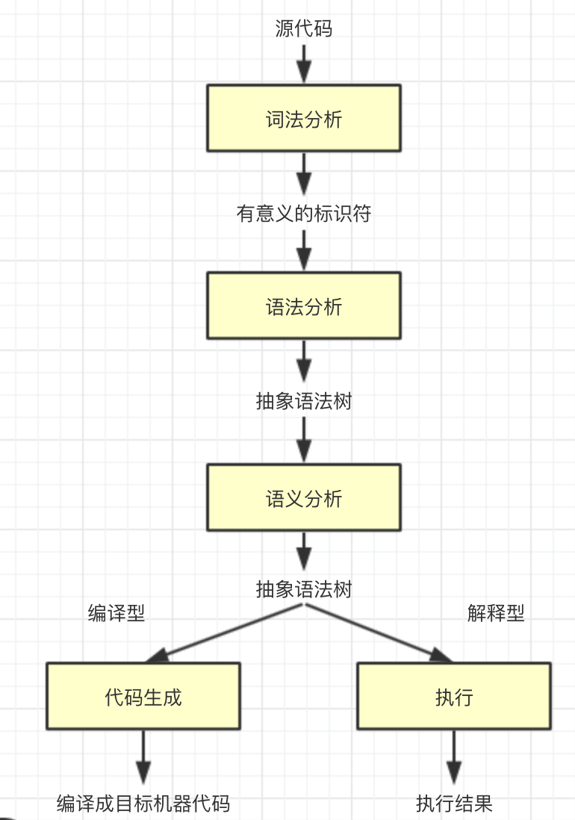

### 完整流程
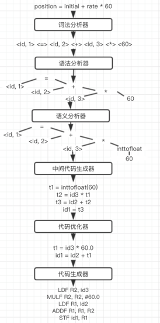

## 语法分析常用的文法
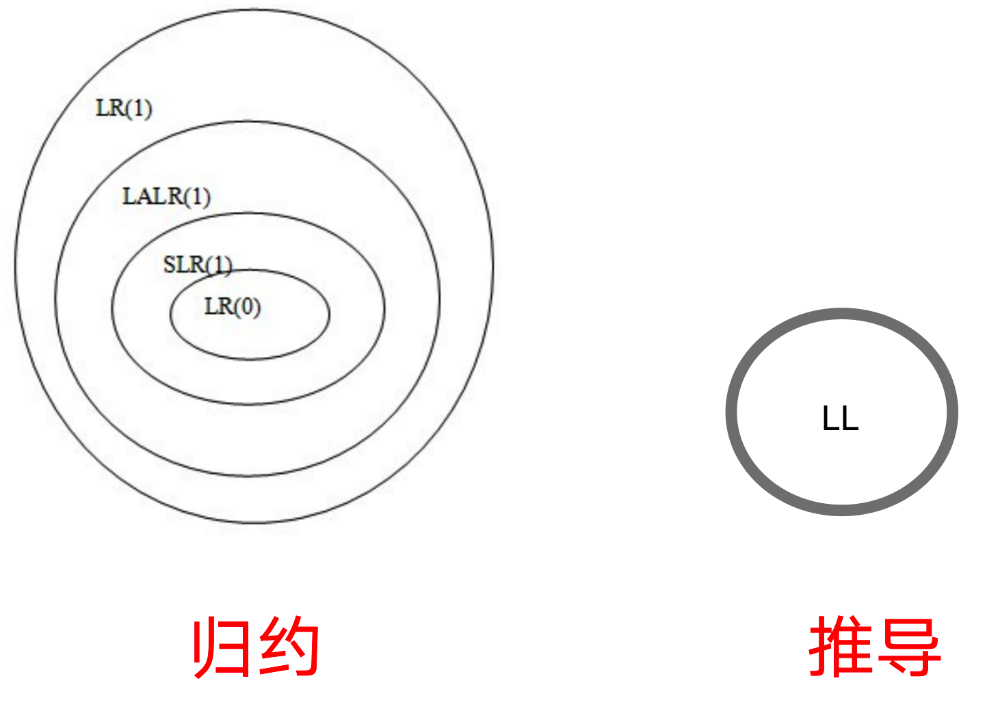

### LL 文法
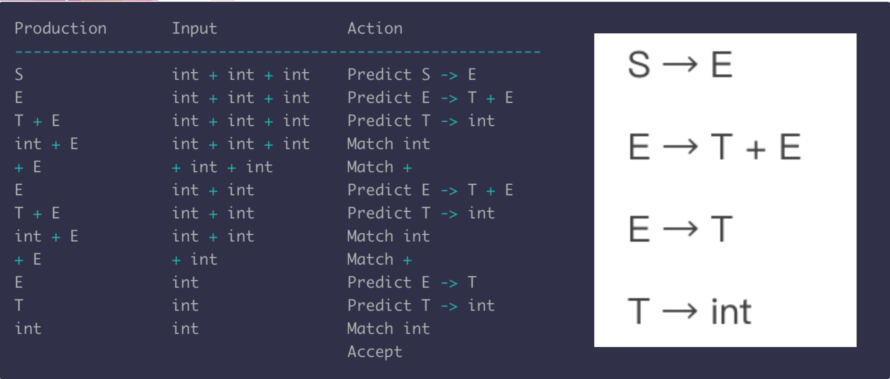

### LR 文法
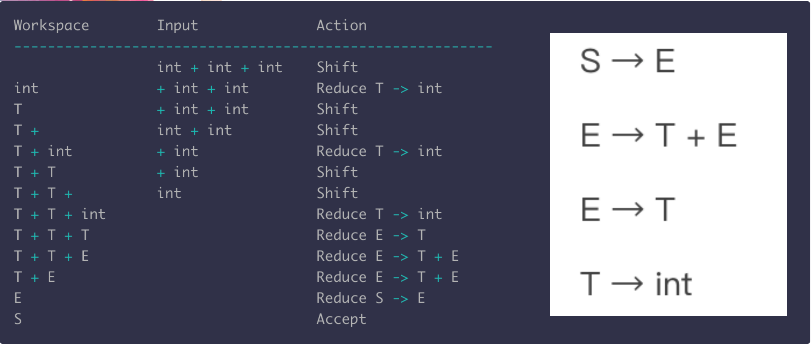

## Boolean 表达式解析后的语法树
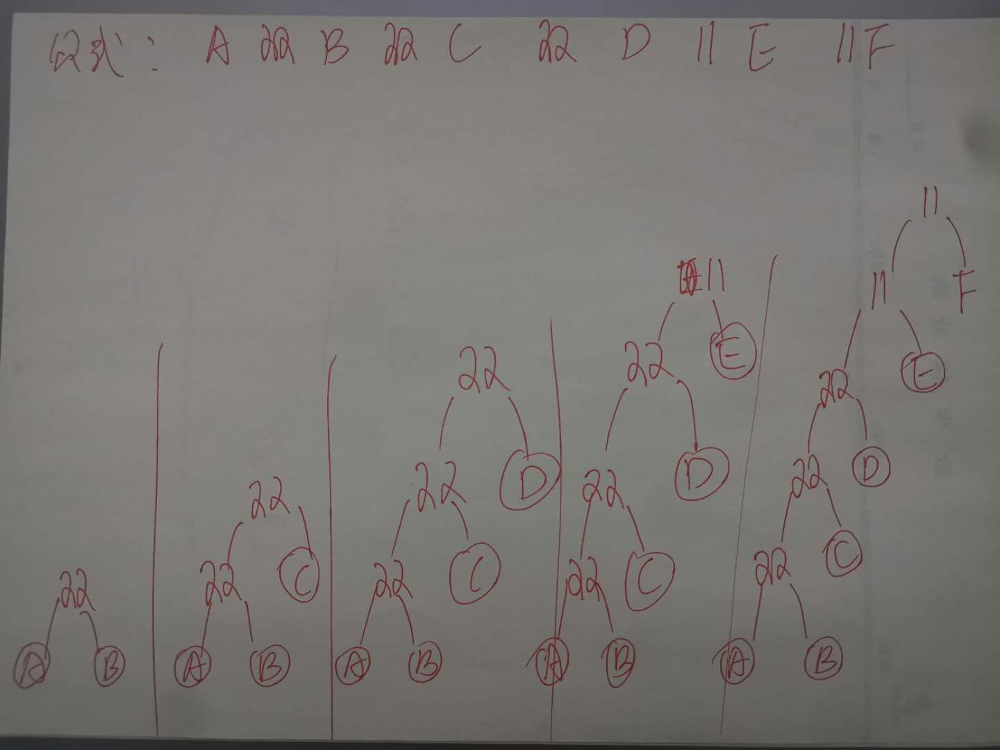
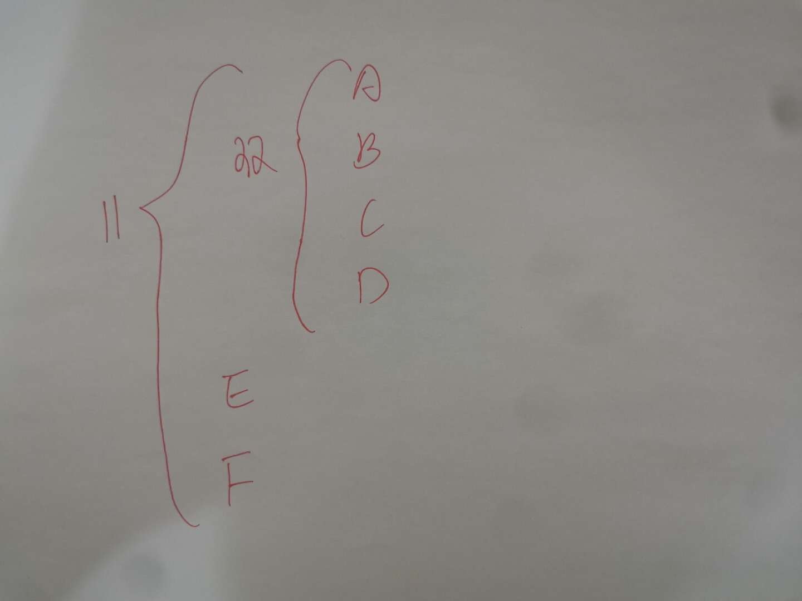

## jison 处理表达式（词法分析与语法分析）
```
/* description: Parses end executes mathematical expressions. */

/* lexical grammar */
%lex
%%

\s+                   /* skip whitespace */
['].*?[']                                           return 'STRING'
["].*?["]                                           return 'STRING'

(\$dec\.)((?:(?!\&\&|\|\|)[^])*)(==(\s)*(true|false))             return 'STRING'           /* 需要比 contains** */
"$dec.containsAll"                                                return 'DEC_CONTAINSALL'
"!"\s*"$dec.containsAll"                                          return 'DEC_NOT_CONTAINSALL'
"$dec.containsIntersection"                                       return 'DEC_CONTAINSINTERSECTION'
"$dec.notContainsIntersection"                                    return 'DEC_NOT_CONTAINSINTERSECTION'
"$dec.contains"                                                   return 'DEC_CONTAINS'
"!"\s*"$dec.contains"                                             return 'DEC_NOT_CONTAINS'
"$dec"                                                            return 'DEC'
"."                                                               return '.'
","                                                               return ','


"&&"                   return '&&'
"||"                   return '||'
"("                    return '('
")"                    return ')'
"=="                   return '=='
"!="                   return '!='
"!"                    return '!'
">="                   return '>='
">"                    return '>'
"<="                   return "<="
"<"                    return '<'

[-]?[0-9]+(\.[0-9]+)?                                             return 'NUMBER'
true|false                                                        return 'BOOLEAN'
null                                                              return 'NULL'

[a-zA-Z_\+\-\*\/\%\u4e00-\u9fa5][a-zA-Z0-9_\+\-\*\/\%\u4e00-\u9fa5]*                  return 'IDENTIFIER'
[\w]+[\u4e00-\u9fa5]+[0-9a-zA-Z_\u4e00-\u9fa5]*                   return 'IDENTIFIER'
[\u4e00-\u9fa5][0-9a-zA-Z_\u4e00-\u9fa5]*                         return 'IDENTIFIER'

<<EOF>>                return 'EOF'

/lex

/* operator associations and precedence */
%left '||'
%left '&&'
%left '!=' '!' '=='
%left '>=' '>' '<=' '<'

%start expressions

%% /* language grammar */

expressions
    : e EOF
        {return $1;}
    ;
// 逻辑组合 根节点
e
    : identifier
        { $$ = $1 }
    | exist
        { $$ = $1 }
    | not_exist
    | intersection
        { $$ = $1 }
    | no_intersection
        { $$ = $1 }
    | belong
        { $$ = $1 }
    | not_belong
        { $$ = $1 }
    | function
        { $$ = $1 }
    | e '&&' e
        { $$ = { type:'logic_op', op:'&&', l_expr:$1, r_expr:$3, toString:()=>$1.toString()+'&&'+$3.toString() } }
    | e '||' e
        { $$ = { type:'logic_op', op:'||', l_expr:$1, r_expr:$3, toString:()=>$1.toString()+'||'+$3.toString()} }
    | '!' e
        { $$ = { type:'logic_op', op:'!', r_expr:$2, toString:()=>'!'+$2.toString()} }
    | e '!=' e
        { $$ = { type:'binary_op', op:'!=', l_expr:$1, r_expr:$3, toString:()=>$1.toString()+'!='+$3.toString()} }
    | e '==' e
        { $$ = { type:'binary_op', op:'==', l_expr:$1, r_expr:$3, toString:()=>$1.toString()+'=='+$3.toString()} }
    | e '>=' e
        { $$ = { type:'binary_op', op:'>=', l_expr:$1, r_expr:$3, toString:()=>$1.toString()+'>='+$3.toString()} }
    | e '>' e
        { $$ = { type:'binary_op', op:'>', l_expr:$1, r_expr:$3, toString:()=>$1.toString()+'>'+$3.toString()} }
    | e '<=' e
        { $$ = { type:'binary_op', op:'<=', l_expr:$1, r_expr:$3, toString:()=>$1.toString()+'<='+$3.toString()} }
    | e '<' e
        { $$ = { type:'binary_op', op:'<', l_expr:$1, r_expr:$3, toString:()=>$1.toString()+'<'+$3.toString()} }
    | '(' e ')'
        { $$ = { type:'', op:"()", expr:$2, toString:()=>'('+$2.toString()+')'} }
    ;
// 标识符 叶子结点

identifier
    : number
        { $$ = $1 }
    | string
        { $$ = $1 }
    | boolean
        { $$ = $1 }
    | null
        { $$ = $1 }
    | IDENTIFIER { $$ = { type:'Identifier', value:$1, toString:()=> $1 } }
    | identifier '.' IDENTIFIER { $$ = $1; $1.value += '.' + $3; $$.toString = ()=> $1.value }
    ;
identifier_list
    : identifier { $$ = [ $1 ] }
    | identifier_list ',' identifier { $$ = $1; $1.push($3); }
    ;

number
    : NUMBER { $$ = { type:'Number', value:$1, toString:()=> $1 } }
    ;

string
    : STRING { $$ = { type:'String', value:$1, toString:()=> $1 } }
    ;

boolean
    : BOOLEAN { $$ = { type:'Boolean', value:$1, toString:()=> $1 } }
    ;

null
    : NULL { $$ = { type:'Null', value:$1, toString:()=> $1 } }
    ;

function
    : identifier '(' identifier_list ')' { $$ = {type:'Function', name:$1.value, params:$3, toString:()=> $1.value+'('+$3.map(i=>i.toString()).join(',')+')'} }
    | DEC '.' function { $$ = {type: $3.type, name: '$dec.'+$3.name, params: $3.params, toString:()=> '$dec.'+$3.toString() } }
    ;

belong
    : DEC_CONTAINSALL '(' identifier ',' identifier ')'
        { $$ = { type:'binary_op', op:'belong', l_expr:$3, r_expr:$5, toString:()=> '$dec.containsAll('+$3.toString()+','+$5.toString()+')' } }
    ;

not_belong
    : DEC_NOT_CONTAINSALL '(' identifier ',' identifier ')'
        { $$ = { type:'binary_op', op:'not_belong', l_expr:$3, r_expr:$5, toString:()=> '!$dec.containsAll('+$3.toString()+','+$5.toString()+')' } }
    ;

exist
    : DEC_CONTAINS '(' identifier ',' identifier ')'
        { $$ = { type:'binary_op', op:'exist', l_expr:$3, r_expr:$5, toString:()=> '$dec.contains('+$3.toString()+','+$5.toString()+')' } }
    ;

not_exist
    : DEC_NOT_CONTAINS '(' identifier ',' identifier ')'
        { $$ = { type:'binary_op', op:'not_exist', l_expr:$3, r_expr:$5, toString:()=> '!$dec.contains('+$3.toString()+','+$5.toString()+')' } }
    ;

intersection
    : DEC_CONTAINSINTERSECTION '(' identifier ',' identifier ')'
        { $$ = { type:'binary_op', op:'intersection', l_expr:$3, r_expr:$5, toString:()=> '$dec.containsIntersection('+$3.toString()+','+$5.toString()+')' } }
    ;

no_intersection
    : DEC_NOT_CONTAINSINTERSECTION '(' identifier ',' identifier ')'
        { $$ = { type:'binary_op', op:'no_intersection', l_expr:$3, r_expr:$5, toString:()=> '$dec.notContainsIntersection('+$3.toString()+','+$5.toString()+')' } }
    ;
```

## 抽象 Boolean 表达式生成的 AST 语法树
```
// A && B && C && D || E || F

const simpleAST = {
    type: '||',
    left: {
        type: '||',
        left: {
            type: '&&',
            left: {
                type: '&&',
                left: {
                    type: '&&',
                    left: {
                        type: 'exp',
                        expression: 'A'
                    },
                    right: {
                        type: 'exp',
                        expression: 'B'
                    }
                },
                right: {
                    type: 'exp',
                    expression: 'C'
                }
            },
            right: {
                type: 'exp',
                expression: 'D'
            }
        },
        right: {
            type: 'exp',
            expression: 'E'
        }
    },
    right: {
        type: 'exp',
        expression: 'F'
    }
};
```


## 定义数据结构
```
// 示例，定义结构
const construct = {
    operation: '||',
    children: [],
}
```

## 递归解析抽象语法树
```
const handleFunc = (AST) => {
    if (AST.type === 'exp') {   // 如果是叶子结点
        return AST;
    } else {
        const tempLeft = handleFunc(AST.left);
        const tempRight = handleFunc(AST.right);
        if (!tempLeft.operation && !tempRight.operation) {  // 左右均为叶子结点
            return {
                operation: AST.type,
                children: [tempLeft, tempRight]
            };
        } else if (tempLeft.operation && !tempRight.operation) {    // 仅右边为叶子结点
            if (tempLeft.operation === AST.type) {  // 如果下层结点与本层结点的操作符相同，合并
                return {
                    operation: AST.type,
                    children: [...tempLeft.children, tempRight]
                };
            } else {  // 如果下层结点与本层结点的操作符相同，不可合并
                return {
                    operation: AST.type,
                    children: [tempLeft, tempRight]
                };
            }
        } else if (!tempLeft.operation && tempRight.operation) {    // 仅左边为叶子结点
            if (tempRight.operation === AST.type) {  // 如果下层结点与本层结点的操作符相同，合并
                return {
                    operation: AST.type,
                    children: [tempLeft, ...tempRight.children]
                };
            } else {  // 如果下层结点与本层结点的操作符相同，不可合并
                return {
                    operation: AST.type,
                    children: [tempLeft, tempRight]
                };
            }
        } else {    // 均不为叶子结点
            if (tempLeft.operation === tempRight.operation === AST.type) {  // 如果左右根结点都相同
                return {
                    operation: AST.type,
                    children: [...tempLeft.children, ...tempRight.children]
                }
            } else if (tempLeft.operation === AST.type) {   // 如果左根结点相同
                return {
                    operation: AST.type,
                    children: [...tempLeft.children, tempRight]
                }
            } else if (tempLeft.operation === AST.type) {   // 如果右根结点相同
                return {
                    operation: AST.type,
                    children: [tempLeft, ...tempRight.children]
                }
            } else {
                return {
                    operation: AST.type,
                    children: [tempLeft, tempRight]
                }
            }
        }
    }
}

console.log(handleFunc(simpleAST));
```

## 可视化渲染
```
const drawExpression = (data) => {
    return `
        <div class="container">
            <div><span>${data.operation}</span></div>
            <div>
                ${data.children.map(item => {
                    if (item.operation) {
                        return drawExpression(item);
                    } else {
                        return `
                            <div class="expression"><span>${item.expression}</span></div>
                        `;
                    }
                }).join('')}
            </div>
        </div>
    `;
};

document.body.innerHTML = drawExpression(handleFunc(simpleAST));
```
