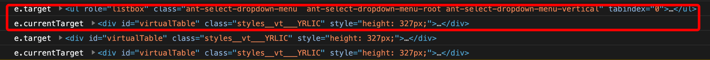
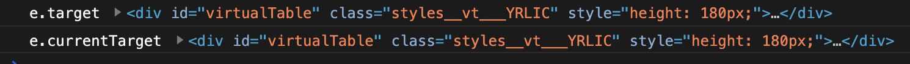
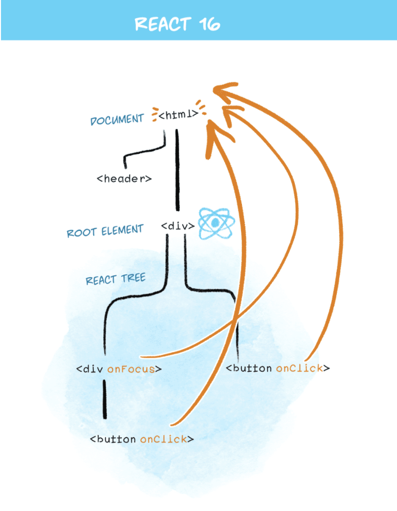
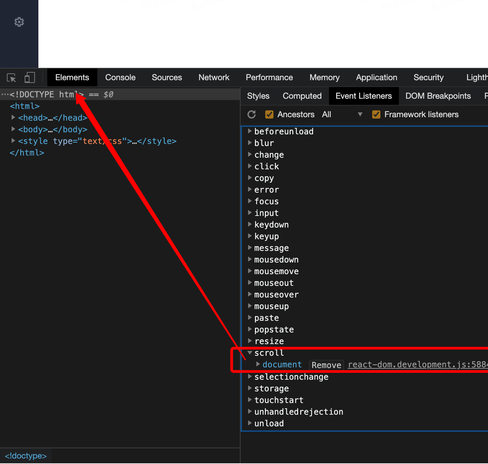

# react onScroll 事件与 Element.addEventListener("scroll", myScript) 对比

昨天同事碰到一个 bug，外面容器监听自己的滚动事件，容器内部有个 select，select 滚动时触发了外面容器的滚动，解决和定位分析问题的过程很有趣，因此记录下来。

## 代码还原
大致结构如下：

```js
import React from 'react';

export default () => {
  const scrollCallback = (e) => {
    // do something...
  }

  return (
    <div
      id="virtualTable"
      onScroll={scrollCallback}
    >
      <Select>
        {data?.map((item) => (
          <Select.Option value={item} key={item}>
            {item}
          </Select.Option>
        ))}
      </Select>
    </div>
  );
}

```

## 问题分析
之前是用的 document.getElementById('virtualTable').addEventListener('scroll', scrollCallback) 方式绑定，没有问题，code-review 做了 ”等价替换“，使用了 react 的 onScroll 绑定

## 复现之前的代码

```js
import React from 'react';

export default () => {
  const scrollCallback = (e) => {
    // do something...
  }

  useEffect(() => {
    document.getElementById('virtualTable').addEventListener('scroll', scrollCallback);
  });

  return (
    <div
      id="virtualTable"
    >
      <Select>
        {data?.map((item) => (
          <Select.Option value={item} key={item}>
            {item}
          </Select.Option>
        ))}
      </Select>
    </div>
  );
}

```

## 尝试找出差异

### 1. 使用 react onScroll
我们在 scrollCallback 中打印 e.target 和 e.currentTarget，发现现在的 react 事件，滚动 "内部的选择框" 以及 "容器" 的时候，打印结果如下：



上图中：红色框中的是 "内部的选择框" 的滚动事件，发现 e.target 是 “Select元素”，e.currentTarget 是 “容器元素”；红色框下方的是 “容器” 的滚动事件，e.target 和 e.currentTarget 都是 “容器元素”。

### 2. 使用 Element.addEventListener("scroll", myScript)
打印结果如下：



上图中：仅容器的滚动触发了监听，且 e.target 和 e.currentTarget 都是 “容器元素”。


## 原因分析
1. react onScroll 事件与 Element.addEventListener("scroll", myScript) 并不等价，两者存在区别，Element.addEventListener("scroll", myScript) 是把 scroll 事件绑定到了绑定元素上，onScroll 是使用了 react 的事件代理。



2. e.target 是当前触发问题的元素，e.currentTarget 是绑定事件的元素。

## 解决方案：
添加判断条件： e.target 等于 e.targetCurrent，然后才能执行回调

```js
const scrollCallback = (e) => {
  if (e.target === e.targetCurrent) {
    // do something...
  }
}
```

## 抛出一个疑问：
大家有没有注意到，使用了 react 的 onScroll，肯定就是用了委托代理，代理事件在 document，删除后滚动事件肯定就失效了。但是，为什么 e.currentTarget，是我们绑定的元素 “#virtualTable”，而非 document 结点呢？



## 总结
小小一段代码，也会有神奇的事情发生。